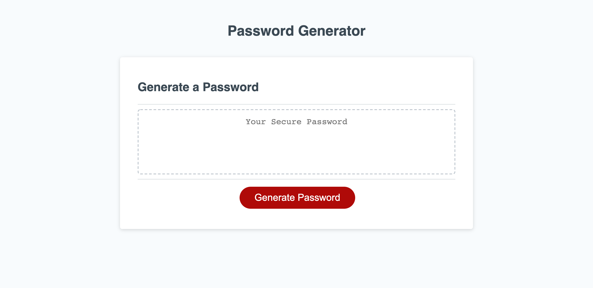

# Password Generator Starter Code

## Purpose

We create a new, secure password every time we click on the button

## Steps to take

### Step 1

 Create the prompts for password criteria using prompt function. Users can select which criteria to include in the password

### Step 2

Create the prompt for the length of the password. Users can choose a length of at least 8 characters and no more than 128 characters. If it is not in the range, users will be asked to do that again

### Step 3

Create prompts for character types to include in the password, including lowercase, uppercase, numeric, and/or special characters. We create the prompts separately asking for yes or no and the value is set to be a boolean

### Step 4

Assign the answer to each prompt to a boolean and then create function so that at least one character type should be selected.

### Step 5

Create a function so that all prompts are answered a password is generated that matches the selected criteria

### Step 6

Create a function so that the password is generated and the password is displayed on the page

# Link to the application

The application is deployed [here](https://wangheer2010.github.io/PasswordGenerator/)

# Screenshot of the application

